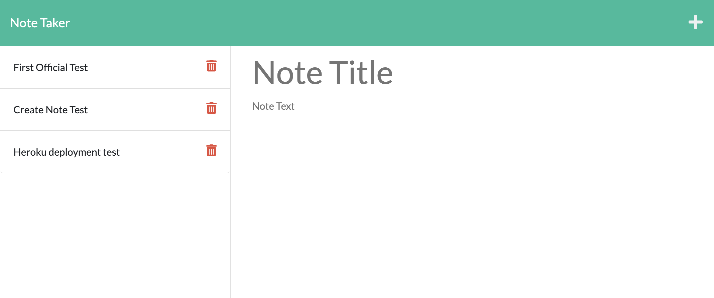

# Note Taker | 

## About the Project:
    
Server held application to create, save, and load notes provided by the user.

## Link to application:
https://agile-plateau-16551.herokuapp.com/

    
## Table of Contents
    
- [Usage](#usage)
- [Contribute](#contribute)
- [Testing](#tests)
- [Questions](#questions)

## Usage Information:
    
At the home page, click the `Get Started` button to continue to the notes app. Enter your notes in and hit the save icon. Click on saved notes on the left side to display them. Click the plus sign to add new note. 

## How to Contribute:
    
No current ways to contribute.

## Tests:
    
No tests to run.

## Questions?

Contact me via [Github](https://github.com/natejboucher) or Email: <natejboucher@gmail.com>
